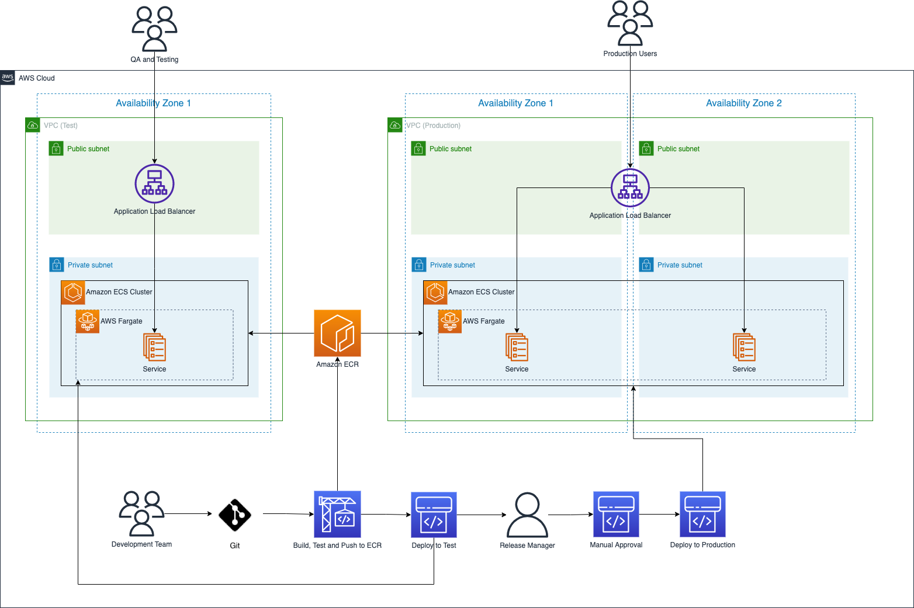

<!-- TOC -->
* [Overview](#overview)
* [Multi-Repository Architecture](#multi-repository-architecture)
  * [Repository Separation](#repository-separation)
  * [This Repository: Infrastructure](#this-repository-infrastructure)
  * [Service Repositories](#service-repositories)
  * [Deployment Flow](#deployment-flow)
* [Project Structure](#project-structure)
* [Technology Stack](#technology-stack)
  * [Infrastructure (CDK)](#infrastructure-cdk)
  * [Services (External Repos)](#services-external-repos)
  * [AWS Services](#aws-services)
  * [Amazon ECS Features](#amazon-ecs-features)
  * [Managing Secrets and Parameters](#managing-secrets-and-parameters)
  * [ECS Access](#ecs-access)
<!-- TOC -->

# Overview

This is an AWS Infrastructure as Code (IaC) project demonstrating a 
**multi-repository, team-based architecture** for deploying containerized 
applications to Amazon ECS.

UH Groupings will be used for this demonstration.

Key principles:
- **Infrastructure** is centralized in this repository (AWS CDK)
- **Services** are developed in separate repositories (API and UI teams)
- **Images** are built independently and stored in AWS ECR
- **Deployment** is orchestrated by this repository via GitHub Actions



# Multi-Repository Architecture

## Repository Separation

This project uses a multi-repository architecture where code is organized by team and responsibility:

```
GitHub Organization: uhawaii-system-its-ti-iam
│
├── example-aws-iac (THIS REPOSITORY)
│   └── Infrastructure as Code (CDK, deployment orchestration)
│
├── uh-groupings-api (EXTERNAL REPOSITORY)
│   └── API microservice (Java/Node.js source code)
│   └── https://github.com/uhawaii-system-its-ti-iam/uh-groupings-api/tree/release-prod
│
└── uh-groupings-ui (EXTERNAL REPOSITORY)
    └── UI microservice (React source code)
    └── https://github.com/uhawaii-system-its-ti-iam/uh-groupings-ui/tree/release-prod
```

## This Repository: Infrastructure

**Purpose:** Define and deploy AWS cloud infrastructure

**Owned by:** Infrastructure/DevOps team

**Contains:**
- AWS CDK infrastructure definitions
- Network infrastructure (VPC, subnets, security groups)
- Application infrastructure (ECS cluster, services, load balancer)
- Data infrastructure (databases, caching, secrets)
- GitHub Actions workflows for deployment
- References to Docker images in AWS ECR

**Does NOT contain:**
- API source code
- UI source code
- Service-specific Dockerfiles
- Service dependencies or tests

### Key Files:
- `infra/stacks/network_stack.py` - VPC, subnets, networking
- `infra/stacks/app_stack.py` - ECS cluster, services, ALB (references external images)
- `infra/stacks/data_stack.py` - RDS, ElastiCache, S3, Secrets Manager
- `infra/stacks/log_archival_stack.py` - S3, CloudWatch, Lambda for log archival
- `.github/workflows/deploy-dev.yml` - Development deployment workflow
- `.github/workflows/deploy-prod.yml` - Production deployment workflow

## Service Repositories

### uh-groupings-api
**Repository:** https://github.com/uhawaii-system-its-ti-iam/uh-groupings-api/tree/release-prod

**Owned by:** API development team

**Contains:**
- API source code (Java or Node.js)
- Dockerfile (builds API container image)
- package.json / pom.xml (dependencies)
- GitHub Actions workflow to build and push images to ECR
- API tests

**Workflow:** Code → Build → Docker Image → AWS ECR

### uh-groupings-ui
**Repository:** https://github.com/uhawaii-system-its-ti-iam/uh-groupings-ui/tree/release-prod

**Owned by:** UI/Frontend team

**Contains:**
- React source code
- Dockerfile (builds UI container image)
- package.json (npm dependencies)
- GitHub Actions workflow to build and push images to ECR
- UI tests

**Workflow:** Code → Build → Docker Image → AWS ECR

## Deployment Flow

This project supports **two deployment environments**:
- **Test Environment**: Automatically deploys when images are pushed to ECR
- **Production Environment**: Manually deployed after infrastructure team review

```
API Development Team                UI Development Team
         │                                    │
         ├─ Commit to release-prod            ├─ Commit to release-prod
         │                                    │
         ▼                                    ▼
  GitHub Actions Workflow            GitHub Actions Workflow
  (uh-groupings-api)                 (uh-groupings-ui)
  [AUTOMATICALLY TRIGGERED]          [AUTOMATICALLY TRIGGERED]
         │                                    │
         ├─ Build Docker image                ├─ Build Docker image
         ├─ Test image                        ├─ Test image
         ├─ Push to AWS ECR                   ├─ Push to AWS ECR
         │    (api:release-prod)              │    (ui:release-prod)
         │                                    │
         └────────────┬───────────────────────┘
                      │
                      ▼
              AWS ECR (Private Registry)
                      │
        ┌─────────────┴─────────────┐
        │                           │
        ▼                           ▼
╔════════════════════════════╗   ╔════════════════════════════╗
║   TEST ENVIRONMENT         ║   ║  PRODUCTION ENVIRONMENT    ║
║  [AUTOMATIC DEPLOYMENT]    ║   ║  [MANUAL DEPLOYMENT]       ║
╚════════════════════════════╝   ╚════════════════════════════╝
        │                           │
        │                    Infrastructure Team
        │                      (example-aws-iac)
        │                           │
        │                           ├─ Update app-stack.ts
        │                           ├─ Commit to main
        │                           │
        ▼                           ▼
   GitHub Actions              GitHub Actions
   (deploy-dev.yml)            (deploy-prod.yml)
   [AUTO-TRIGGERED]            [MANUAL TRIGGER]
        │                           │
        ├─ CDK Synth        Infrastructure team must:
        ├─ Deploy to Test   1. Review changes
        │                   2. Manually trigger
        ▼                   3. Approve deployment
   AWS ECS                          │
   (Test Cluster)                   ▼
        │                   ┌──────────────────┐
        ├─ Test API         │ CDK Synth        │
        ├─ Test UI          │ (Production)     │
        └─ Test ALB         └──────────────────┘
                                    │
                                    ▼
                            ┌──────────────────┐
                            │ CDK Deploy       │
                            │ (Production)     │
                            └──────────────────┘
                                    │
                                    ▼
                            AWS ECS (Prod Cluster)
                                    │
                                    ├─ Prod API
                                    ├─ Prod UI
                                    └─ Prod ALB
```

### Deployment Strategy

**Service Team Workflow** (Same for both Test & Production)
1. Develop feature in service repository
2. Commit and push to `release-prod` branch
3. GitHub Actions automatically builds and tests the image
4. Image pushed to AWS ECR with tag: `release-prod`

**Test Environment** (Automatic)
- Images automatically pulled from ECR
- Test ECS cluster updated with latest builds
- Enables continuous testing and validation
- No manual approval needed
- Runs concurrently with service development

**Production Environment** (Manual)
- Infrastructure team reviews and updates `app-stack.ts` with new image versions
- Changes committed to `main` branch
- Workflow is ready but **awaits manual trigger**
- Infrastructure team must explicitly approve and trigger deployment
- Provides control point before production changes


# Project Structure

```
example-aws-iac/
├── .github/
│   └── workflows/
│       ├── deploy-dev.yml      # Deploy infrastructure to development
│       └── deploy-prod.yml     # Deploy infrastructure to production
│
├── infra/                       # AWS CDK Infrastructure Code (Python)
│   ├── app.py                   # CDK app entry point
│   │
│   ├── stacks/
│   │   ├── network_stack.py     # Network infrastructure
│   │   ├── app_stack.py         # ECS, Services, ALB
│   │   │                        # References:
│   │   │                        # - ECR image: uh-groupings-api:release-prod
│   │   │                        # - ECR image: uh-groupings-ui:release-prod
│   │   ├── data_stack.py        # RDS, caching, secrets
│   │   └── log_archival_stack.py # S3, CloudWatch, Lambda for log archival
│   │
│   ├── cdk.json                 # CDK configuration
│   ├── requirements.txt         # Python dependencies
│   └── setup.py                 # Python project setup
│
├── services/                    # Service References (NOT source code)
│   ├── api/
│   │   ├── README.md            # Reference to uh-groupings-api
│   │   └── Dockerfile           # Example Dockerfile structure
│   │
│   └── ui/
│       ├── README.md            # Reference to uh-groupings-ui
│       └── Dockerfile           # Example Dockerfile structure
│
├── docs/
│   └── architecture/
│       ├── README.md            # Architecture overview
│       └── MULTI_REPO_ARCHITECTURE.md  # Detailed architecture docs
│
├── resources/
│   ├── aws-cloud.png
│   └── aws-fargate.png
│
└── README.md                    # This file
```

# Technology Stack

## Infrastructure (CDK)
- **AWS Cloud Development Kit (Python)** - Infrastructure as Code framework
- **Python 3.9+** - CDK language binding
- **AWS CodePipeline** - CI/CD orchestration
- **AWS CodeBuild** - Build infrastructure
- **AWS CodeConnections** - GitHub integration

## Services (External Repositories)
- **Docker** - Container image definition and building
- **Node.js/Java** - API runtime (uh-groupings-api)
- **React** - UI framework (uh-groupings-ui)
- **npm/Maven** - Package management

### AWS Services
- **Amazon Elastic Container Service (ECS)** - Container orchestration
- **AWS Fargate** - Serverless compute for containers
- **Amazon Elastic Container Registry (ECR)** - Private Docker image registry
- **Application Load Balancer (ALB)** - HTTP/HTTPS routing
- **Amazon RDS** - Managed relational database
- **Amazon ElastiCache** - In-memory caching
- **AWS Secrets Manager** - Credential and secret management
- **Amazon VPC** - Virtual network
- **Amazon CloudWatch** - Monitoring and logging

## Amazon ECS Features

- A serverless option with AWS Fargate (a launch type)
- Integration with AWS Identity and Access Management (IAM)
- Volume mounting for persistent data storage
- Support for mounting Amazon EFS into ECS tasks (including Fargate)
- For databases, the standard AWS pattern is RDS/Aurora

## Managing Secrets and Parameters

| Option              | Pros                                          | Use Case                             |
|---------------------|-----------------------------------------------|--------------------------------------|
| **Secrets Manager** |                                               |                                      |
|                     | Native credential rotation                    |                                      |
|                     | Designed for sensitive data                   |                                      |
|                     | Full audit trail                              | API keys, database passwords, tokens |
|                     | Encryption at rest and in transit             | Injected via CDK into ECS task env   |
| **Parameter Store** |                                               |                                      |
|                     | Simple key-value store                        |                                      |
|                     | Hierarchical organization (/prod/api/timeout) | Configuration values, feature flags  |
|                     | Free tier available                           | Injected via CDK into ECS task env   |
|                     | Good for non-sensitive config                 |                                      |

Note: Values are injected into container environment at task startup via CDK.

## ECS Access

- **AWS Management Console** — Web interface
- **AWS Command Line Interface (AWS CLI)** — Command-line access
- **AWS SDKs** — Language-specific APIs
- **AWS Copilot** — Developer-focused tool for ECS
- **Amazon ECS CLI** — Docker Compose format support
- **AWS CDK** — Infrastructure as Code (used in this project)
  - Best overall for Git-based configuration management
  - Enables version control and code review workflows

# Workflow Summary

## For API Development Team
1. Develop features in `uh-groupings-api` repository
2. Commit and push to `release-prod` branch
3. GitHub Actions automatically builds Docker image
4. Image pushed to AWS ECR with tag `uh-groupings-api:release-prod`
5. Infrastructure team notified of new image availability

## For UI Development Team
1. Develop features in `uh-groupings-ui` repository
2. Commit and push to `release-prod` branch
3. GitHub Actions automatically builds Docker image
4. Image pushed to AWS ECR with tag `uh-groupings-ui:release-prod`
5. Infrastructure team notified of new image availability

## For Infrastructure Team
1. Monitor for new images in AWS ECR
2. Update `infra/lib/app-stack.py` with new image URIs (optional versioning)
3. Commit changes to `example-aws-iac`
4. GitHub Actions automatically deploys infrastructure
5. ECS pulls new images and launches updated services

# Next Steps

1. ✅ Infrastructure repository (`example-aws-iac`) configured
2. ⏳ Configure ECR repositories in AWS
3. ⏳ Ensure service repositories have build workflows pushing to ECR
4. ⏳ Deploy infrastructure for the first time
5. ⏳ Monitor ECS services and logs in CloudWatch
