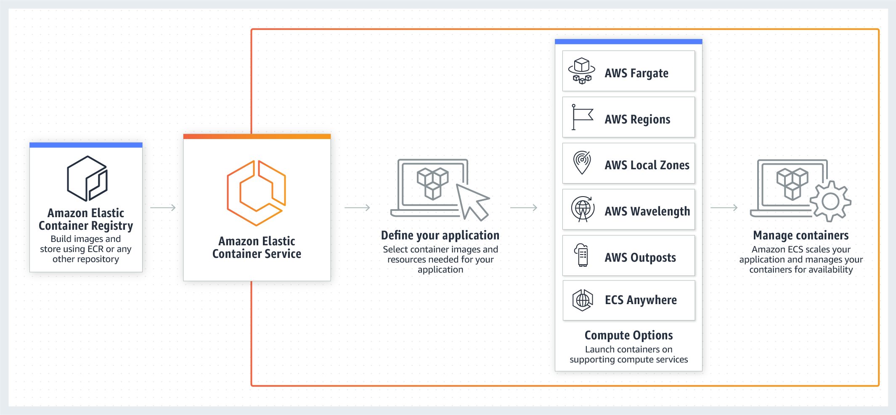

# Overview

As a learning exercise, prepare an example, hypothetical AWS Infrastructure as 
Code (IaC) project for a containerized application running on Amazon Elastic 
Container Service (ECS).

# Tech stack

- AWS Cloud Development Kit
- AWS CodeConnections
- AWS CodeBuild
- AWS CodePipeline
- Docker
- Amazon Elastic Container Registry
- Amazon Elastic Container Service

## Amazon ECS provides the following features

- A serverless option with AWS Fargate (a launch type).
- Integration with AWS Identity and Access Management (IAM).
- To mount volumes for information that must persist
- AWS supports mounting Amazon EFS into ECS tasks, including Fargate tasks. EFS is the persistent, network file system option intended for this use case.
- For a database, the simpler and more standard AWS pattern is usually RDS/Aurora.

Managing secrets and parameters:

| Option          | Pros                                          | Cons           |
|-----------------|-----------------------------------------------|----------------|
| Secrets Manager |                                               |                |
|                 | native rotational support                     | more expensive |
|                 | designed for sensitive workflows              | more complex   |
|                 | auditability                                  |                |
|                 | best for secrets                              |                |
| Parameter Store |                                               |                |
|                 | simple key-value store                        |                |
|                 | hierarchical organization (/prod/app/db/host) |                |
|                 | cheaper/free                                  |                |
|                 | best for configuration management             |                |

Note: the values are injected at container startup.

## ECS Access

- AWS Management Console — a web interface
- AWS Command Line Interface (AWS CLI)
- AWS SDKs — Provides language-specific APIs and takes care of many of the connection details.
- AWS Copilot — Provides an open-source tool for developers to build, release, and operate production ready containerized applications on Amazon ECS.
- Amazon ECS CLI — Provides a command line interface for you to run your applications on Amazon ECS and AWS Fargate using the Docker Compose file format.
  - Note that it just uses the format, but specifies its own set of commands.
- AWS CDK — Provides an open-source software development framework that you can use to model and provision your cloud application resources using familiar programming languages.
  - Probably the best overall for Git-based configuration management

## Infrastructure as Code Strategy

